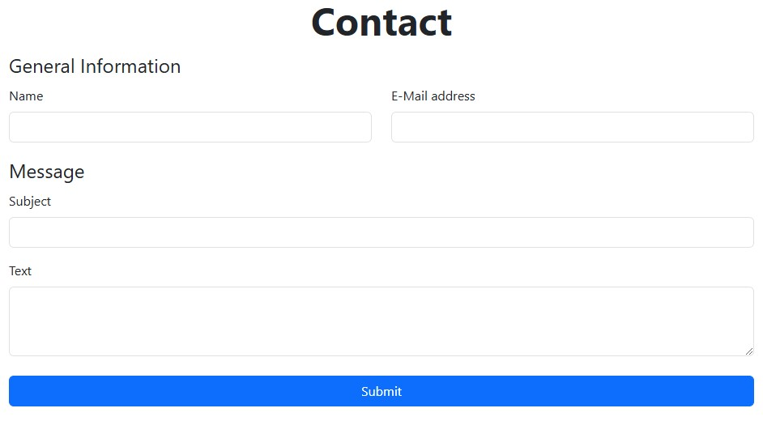
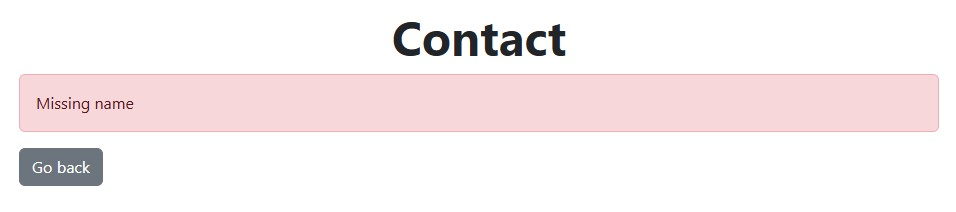

# Aufgabenstellung zu Kontakt

> [!NOTE]
> Diese Aufgabe basiert auf _keinem CS50 Practice Problem_.
>
> **Disclaimer:** Diese Aufgabe wurde nicht vom Lehrstuhl herausgegeben und kann Fehler enthalten. Sie dient lediglich zu Übungszwecken!

Kontaktformulare sind ein zentraler Bestandteil fast jeder Website. Sie bieten eine einfache und strukturierte Möglichkeit, Informationen zwischen Nutzern und Website-Betreibern auszutauschen, sei es für Support-Anfragen, Feedback oder Geschäftsanfragen.

In dieser Aufgabe möchten wir unser eigenes Kontaktformular bauen, sodass auch wir kontaktiert werden könnten!
Hierzu verwenden wir Flask auf der Server-Seite und Bootstrap auf der Client-Seite, dass unsere Website auch gut aussieht.

## Aufgabenmaterial herunterladen

Um das Aufgabenmeterial herunterzuladen, gib folgenden Befehl in _ein neues Terminal_ in deinem Codespace ein:

```bash-vue
wget -O - {{ $url('material/lab-contact.zip.sh') }} | bash
```

## Teilaufgabe 1

Wie immer, wenn wir einen vorgegebenen Code haben, sollten wir diesen zuerst verstehen. Betrachte deshalb den gegebenen Code in `app.py`, `error.html` und `layout.html` und beantworte folgende Fragen.

1. In der Datei `app.py` ist eine Klasse `ContactRequest` gegeben. Diese hat ein Attribut `id` welches _automatisch_ einen eindeutigen String enthält um diese Anfrage zu identifizieren[^1].

    1. Wie kann auf dieses `id` Attribut zugegriffen werden?
    2. Welche anderen Attribute hat diese Klasse noch?

2. In der Datei `error.html` ist ein [Jinja2](https://jinja.palletsprojects.com/) Template gegeben, welches eine Fehlermeldung ausgibt.

    1. In welcher Variable muss der Text für die Fehlermeldung angegeben werden?
    2. Warum findet sich in diesem Template kein `<html>` oder `<body>` Element?`

3. In der Datei `layout.html` ist ein weiteres Template gegeben. Dieses stellt die Struktur unserer Seite dar.
    1. An welcher Stelle ist das Framework [Bootstrap](https://getbootstrap.com/) eingebunden?
    2. Warum benötigen wir diese Datei? Könnten wir nicht einfach das ganze HTML immer kopieren?

Ändere abschließend das Template `layout.html` so ab, dass es mittels `extends` erweitert werden kann um somit Inhalt einzufügen.
Füge hierzu einen _Block_ ein und nenne diesen `body`, sodass das `error.html` Template auch funktioniert.

[^1]: Intern werden hierzu [UUIDs](https://de.wikipedia.org/wiki/Universally_Unique_Identifier) verwendet, das ist für die Bearbeitung der Aufgabe aber nicht von Belang.

<details>
    <summary>Du bist dir nicht sicher was das für ein neuer Syntax in den HTML Dateien ist?</summary>

Unsere HTML-Dateien verwenden hier [Jinja2](https://jinja.palletsprojects.com/en/stable/templates/#template-file-extension) Templates, welche von Flask ausgewertet werden können.
Somit können wir recht einfach HTML dynamisch aus unseren Python Daten erstellen.

Im folgenden findet sich ein einfaches Beispiel, welches in abgewandelter Version auch in der Dokumentation gefunden werden kann.
`open_todos` und `todos` sind hierbei Variablen, die dem Template explizit übergeben wurden.

```html
<div>
    <h1>My ToDos</h1>
    Open todos: {{ open_todos }}

    <ul id="list">
        
        <li>{{ todo }}</li>
        
    </ul>

    {# some comment #}
</div>
```

</details>

> [!WARNING]
> Viele unserer Implementierungen in dieser Aufgabe sind anfällig für diverse Angriffe und sollten in der Praxis anders umgesetzt werden.
> Für die Zwecke von Inf-Einf reicht das aber aus.

## Teilaufgabe 2

Da wir nun die Grundstruktur unserer Website verstanden und erweitert haben, ist es an der Zeit das eigentliche Kontaktformular zu erstellen.

Erstelle hierzu eine neue Datei `index.html` an der passenden Stelle. Erweitere in dieser das `layout.html` und erstelle ein Formular.
Das Formular soll, sobald es abgesendet wird, eine `POST` Anfrage an den `/submit` Pfad (welche wir später in Python definieren werden) senden.

Im Formular muss der Benutzer die Möglichkeit haben, seinen Namen `name`, seine E-Mail `email`, einen Betreff `subject` und eine eigentliche Nachricht `text` einzugeben.
Wähle für jedes dieser Felder ein sinnvolles HTML-Element mit gut gewählten Attributen und achte darauf, dass der Benutzer immer weiß in welchem Feld er sich gerade befindet. Vergiss nicht, auch einen `Send` Button hinzuzufügen.

Füge schließlich noch einen Button hinzu, um das Formular abzusenden.

Dass unser Kontaktformular auch gut aussieht, soll [Bootstrap](https://getbootstrap.com/docs/5.3/getting-started/introduction/) für das Styling verwendet werden. Achte deshalb darauf, allen Elementen passende Bootstrap Klassen zuzuweisen.

Das fertige Formular, inklusive des Layouts, könnte wie im folgenden Bild aussehen.



<details>
    <summary>Du weißt nicht genau wie du ein gut aussehendes Formularfeld mit Bootstrap erstellen kannst?</summary>

Folgender Code ist ein leicht abgeändertes Beispiel aus der [Bootstrap Dokumentation zu Formularen](https://getbootstrap.com/docs/5.3/forms/form-control/).

```html
<label for="title" class="form-label"> Titel </label>
<input type="text" class="form-control" id="title" name="title" />
```

</details>

## Teilaufgabe 3

Da wir nun unsere `index.html` Datei fertig geschrieben haben, sollten wir diese auch über Flask bereitstellen.
Erstelle hierzu in der Datei `app.py` deinen Flask Server.

Beginne damit, deine `app` zu erstellen und definiere schließlich eine `route` für den `/` Pfad.
Der `/` Pfad soll `GET` Anfragen akzeptieren und das Template `index.html` ausgeben.

Wenn du alles richtig gemacht hast, solltest du nun deinen Server starten können, und direkt mit deinem Formular begrüßt werden!

<details>
    <summary>Du weißt nicht genau wie du ein Template aus einer Flask Funktion zurückgeben kannst?</summary>

Um Templates auszugeben (zu "rendern"), kann die Funktion `render_template` verwendet werden.
Folgender Beispielcode würde beispielsweise das Template `todos.html` ausgeben. Nach dem Namen des Templates können optional weitere benannte Parameter folgen um einzelne Variablen im Template verfügbar zu machen.

```python
from flask import render_template

render_template("todos.html", count=4)
```

**Wichtig:** Vergiss nicht, den Rückgabewert von `render_template` auch zu `return`en, sonst wird das Template zwar ausgeführt aber nicht ausgegeben!

</details>

## Teilaufgabe 4

Nun haben wir schon einen Flask Server, welcher unsere `index.html` mit Formular darstellt. Nun möchten wir noch die Eingaben des Formulars verarbeiten.

Erstelle hierzu eine weitere Flask `route` für den Pfad, welchen wir in [Teilaufgabe 2](#teilaufgabe-2) im `<form>` angegeben haben. Diese URL soll nur `POST` Anfragen akzeptieren.
Lies dann in dieser Funktion die per Formular übermittelten Parameter aus und prüfe, ob diese überhaupt angegeben wurden. Sollte ein Parameter fehlen, kannst du das Template `error.html` verwenden um eine Fehlermeldung auszugeben.

Im folgenden findest du ein Beispielbild, wie Fehlermeldungen mit dem `error.html` Template aussehen können.



Sollten alle Daten korrekt übermittelt worden sein, soll aus diesen eine neue `ContactRequest` erstellt werden. Speichere diese `ContactRequest` schließlich in einer Datenstruktur deiner Wahl. Beachte hierbei, dass wir die `ContactRequest` später anhand ihrer `id` finden wollen.
Gib im Erfolgsfall zusätzlich einen `Success!` Text zurück.

> [!NOTE]
> Da wir die `ContactRequest`s nur in einer Variable speichern bedeutet das, dass Kontaktanfragen nur gespeichert werden, solange der Server auch läuft.
> Dies wäre in der Praxis eher unpraktisch. Für die Zwecke dieser Übung ist das aber vollkommen ausreichend.

Achte darauf, dass deine Funktionen auch korrekte [HTTP-Antwortstatuscodes](https://developer.mozilla.org/de/docs/Web/HTTP/Status) verwenden.

<details>
    <summary>Du bist dir nicht sicher, wie du den Wert eines Formularfeldes in Flask auslesen kannst?</summary>

Um den Wert eines übermittelten Formularfeldes auszulesen, kann die `request.form.get(name)` Funktion verwendet werden.
Im folgenden findest du ein informelles Beispiel, um das im HTML dargestellte Feld auszulesen.

```html
<label for="task_field">Task</label> <input name="task" id="task_field" />
```

```python
from flask import request

task = request.form.get("task")
```

**Wichtig:** Dass du ein Feld im HTML-Formular erstellt hast, bedeutet nicht zwingend, dass es auch an den Server übermittelt wird. Prüfe deshalb immer erst ob das Feld nicht `None` ist.

</details>

## Testen

Benutze `flask run` in einem Terminal, während du dich im Verzeichnis `lab-contact` befindest, um deinen Flask-Server zu starten, der die Webseite bereitstellt.

### Korrektheit

Für diese Aufgabe gibt es kein `check50`, da die Implementierungen sehr unterschiedlich ausfallen können.

### Style

Leider unterstützt `style50` keine HTML-Dateien. Daher liegt es an dir, deine HTML-Tags sauber einzurücken und auszurichten.
Deine `app.py` Datei kannst du jedoch mit folgendem Befehl überprüfen.

```bash
style50 app.py
```
